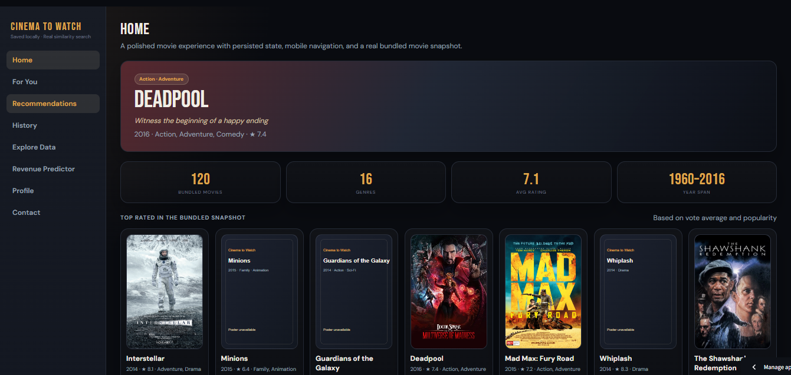
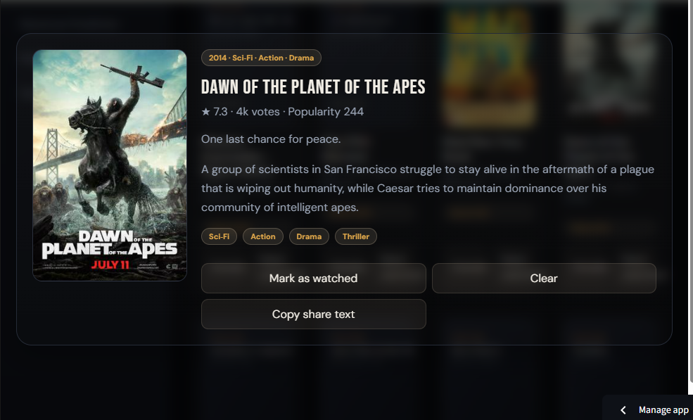

# 🎬 Movie Recommendation System


A **production-style movie discovery system** built on the TMDB 5000 dataset.  
This project combines **machine learning, product design, and deployment practices** into a single portfolio-ready application.

## 🖼️ App Screenshots







## 📌 Overview

This is not just a basic recommender system — it is a **complete ML product** featuring:

- 🎥 Movie recommendation engine  
- 📊 Interactive analytics dashboard  
- 👤 User profiles & watch history  
- 💰 Revenue prediction model  
- ⚙️ CLI for reproducible workflows  
- 📈 Benchmarking & evaluation metrics  

---

## 🧠 Recommendation Engine

### Pipeline

1. Text feature creation (overview + genres + keywords)  
2. TF-IDF vectorization (max 5,000 features)  
3. Dimensionality reduction using Truncated SVD (100 components)  
4. Clustering using K-Means (7 clusters)  
5. Ranking using cosine similarity  

### 🎯 Interview Explanation

> “I built a content-based recommender using TF-IDF for feature extraction, reduced dimensionality with SVD, narrowed candidates via clustering, and ranked results using cosine similarity.”

---

## ✨ Features

### 🎬 Streamlit Application

- Movie recommendations with similarity ranking  
- Poster-based UI for improved user experience  
- Genre, rating, runtime, and cluster analytics  
- Watched history & basic personalization  
- Revenue prediction using Random Forest  

---

### ⚙️ CLI Support

Run key workflows directly from terminal:

```bash
python project.py pipeline
python project.py summary
python project.py compare --sample-size 100 --top 5
python project.py evaluate --sample-size 100 --top 5
python project.py recommend --title "Inception" --top 5
python project.py revenue --budget 160 --popularity 90 --runtime 148 --vote-average 8.3 --vote-count 22000
```

💾 Persistence
```
Stored in .app_data/users.json
Saves user accounts, interests, and watched history
Ignored by Git to keep repository clean
```

📊 Evaluation & Metrics

This project includes real measurable evaluation, not just UI.
```
Scorecard Metrics
Catalog Coverage@k
Genre Coverage@k
Genre Hit Rate@k
Genre Jaccard@k
Mean Similarity@k
Mean Year Gap@k
Average Recommended Rating
Revenue Model: R² / MAE / RMSE
```

Why this matters
```
Most portfolio projects stop at “it works.”
This project demonstrates evaluation, comparison, and ML reasoning — key expectations in real-world roles.
```

🗂️ Project Structure
```
MovieRecommendationSystem/
├── app.py
├── project.py
├── movie_recommendation/
│   ├── __init__.py
│   ├── analysis.py
│   ├── data.py
│   ├── recommender.py
│   └── revenue.py
├── notebooks/
│   ├── eda_overview.ipynb
│   └── recommender_experiments.ipynb
├── .streamlit/config.toml
├── .gitignore
├── requirements.txt
└── tmdb_5000_movies.csv
```
📈 Suggested Visuals (for Portfolio)

Add screenshots like:
```
Genre distribution chart
Movie release trends
Rating histogram
Recommendation comparison table
Revenue model feature importance
```

⚙️ Installation
```
pip install -r requirements.txt
```

📂 Dataset

Place dataset files in the root directory:
```
Required: tmdb_5000_movies.csv
Optional: tmdb_5000_credits.csv (improves recommendations)
```

▶️ Running the Project
```
Run Streamlit App
streamlit run app.py
```

CLI Example
```
python project.py recommend --title "Inception"
```
🚀 Deployment
```
Streamlit Community Cloud
Push project to GitHub
Go to Streamlit Cloud
Select app.py
Add dataset file
Deploy
```

💡 Key Skills Demonstrated
```
Machine Learning (scikit-learn)
NLP (TF-IDF vectorization)
Dimensionality Reduction (SVD)
Clustering (K-Means)
Recommendation Systems
Data Analysis (pandas, NumPy)
Model Evaluation & Benchmarking
Streamlit App Development
CLI Tool Development
Project Structuring & Packaging
```

🏆 Why This Project Stands Out
```
Goes beyond tutorials → real product-style system
Includes evaluation metrics (rare in student projects)
Combines multiple ML use cases (recommendation + regression)
Demonstrates ML + UI + engineering integration
```

📜 License
```
This project is licensed under the MIT License.
```
⭐ Support
```
If you found this project helpful, consider giving it a ⭐ on GitHub!
```
